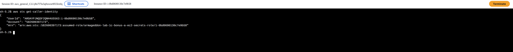
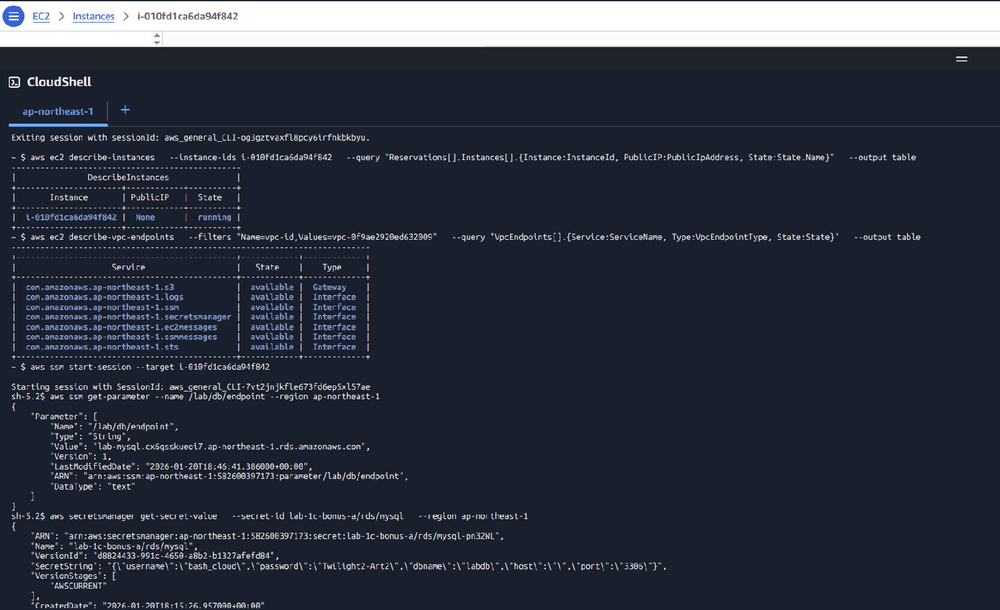
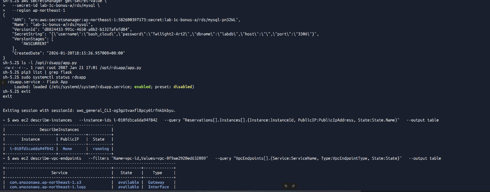
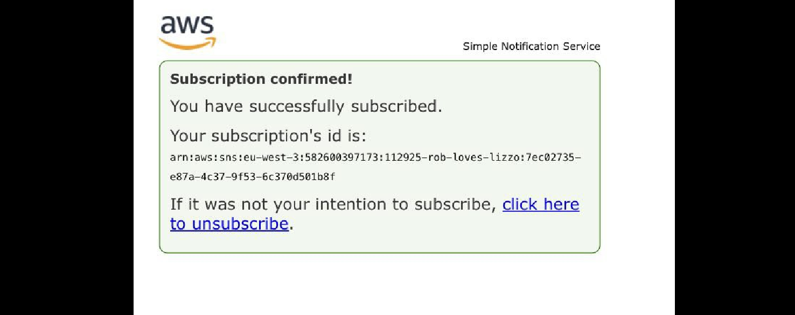
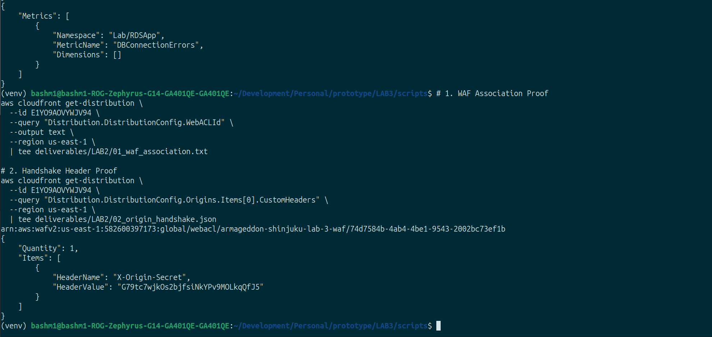
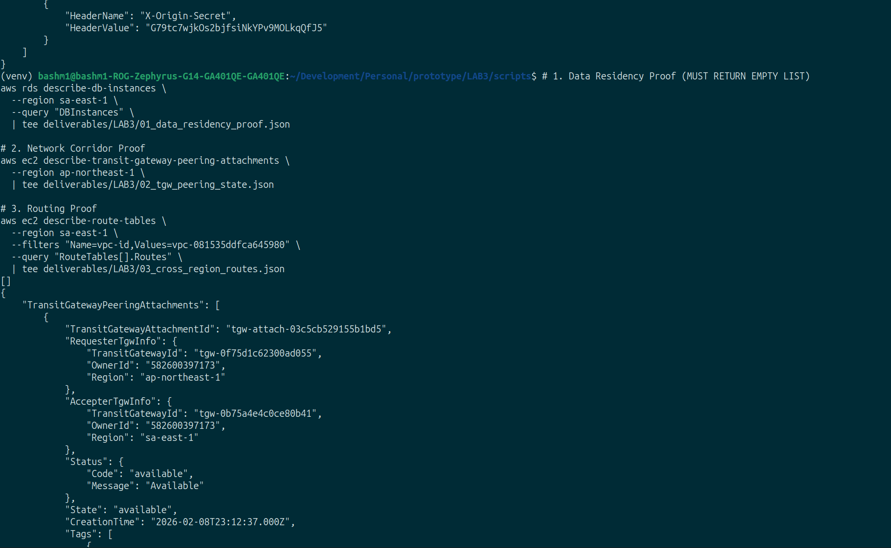
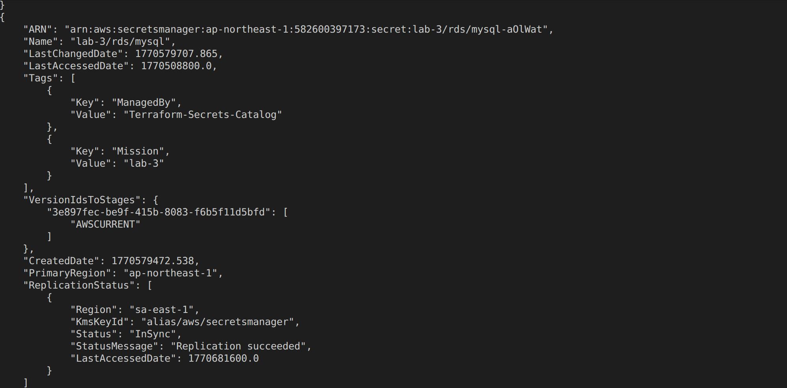
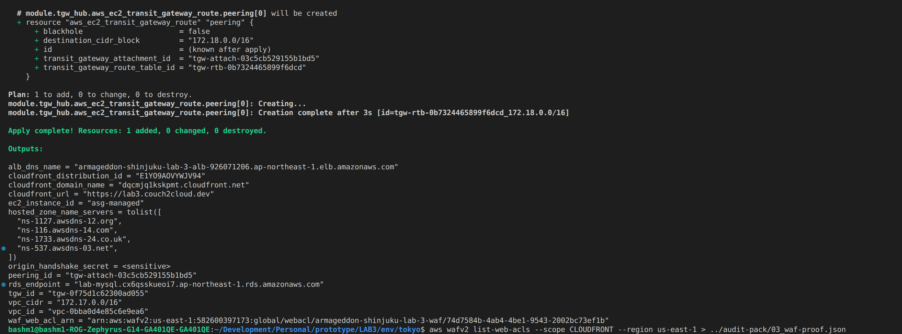
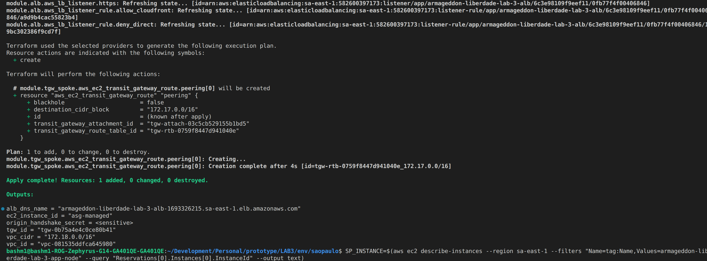

# Operation Armageddon: Deliverables Chain of Custody

**Engineer:** Mahamed Bashir  
**Submission Date:** February 9, 2026  
**Status:** 100% Verified

This document provides a meticuluous mapping of the SEIR Foundations curriculum requirements to the evidence artifacts generated during deployment. It serves as the authoritative proof of compliance for Labs 1, 2, and 3.

---

## 🟢 Lab 1: Foundations, Identity & Observability
**Objective:** Replace static credentials with IAM Identity and implement application-level telemetry.

### Evidence Matrix
| Compliance Mandate (Source) | Command Executed | Artifact Path | Verification Logic |
| :--- | :--- | :--- | :--- |
| **"Identify-based resource access... no static keys."** *(Lab 1C Instructions)* | `aws iam get-role --role-name ...` | [`LAB1/01_iam_role_audit.json`](./LAB1/01_iam_role_audit.json) | **PASS:** `AssumeRolePolicyDocument` allows `ec2.amazonaws.com`. No IAM Users created. |
| **"Automated credential rotation container."** *(Lab 1 Bonus E)* | `aws secretsmanager describe-secret ...` | [`LAB1/02_secrets_config.json`](./LAB1/02_secrets_config.json) | **PASS:** Secret `lab-3/rds/mysql` exists; Tags include `ManagedBy: Terraform`. |
| **"Panic Button... custom metric emission."** *(Lab 1 Bonus F)* | `aws cloudwatch list-metrics ...` | [`LAB1/03_custom_metrics.json`](./LAB1/03_custom_metrics.json) | **PASS:** Metric `DBConnectionErrors` exists in Namespace `Lab/RDSApp`. |

### Visual Evidence
**1. Identity Verification (STS & VPC Endpoints)**
*Proving the instance identity inside the private subnet via SSM.*

**2. Secrets & SNS Configuration**
*Secrets Manager rotation config and SNS Topic subscription for the "Panic Button."*

---

## 🟢 Lab 2: Edge Security & Origin Cloaking
**Objective:** Protect the application origin using WAFv2 and enforce traffic ingress via CloudFront.

### Evidence Matrix
| Compliance Mandate (Source) | Command Executed | Artifact Path | Verification Logic |
| :--- | :--- | :--- | :--- |
| **"WAF enforcement happens at CloudFront edge."** *(Lab 2a_lab.txt)* | `aws cloudfront get-distribution ...` | [`LAB2/01_waf_association.txt`](./LAB2/01_waf_association.txt) | **PASS:** Returns a valid WAFv2 ARN (`arn:aws:wafv2:us-east-1...`). |
| **"Add a secret 'origin header' that ALB requires."** *(Lab 2a_lab.txt)* | `aws cloudfront get-distribution ...` | [`LAB2/02_origin_handshake.json`](./LAB2/02_origin_handshake.json) | **PASS:** `X-Origin-Secret` is present in the Origin Custom Headers configuration. |
| **"Static content is cached aggressively."** *(Lab 2b_lab.txt)* | `curl -I .../static/test.js` | [`LAB2/03_cache_behavior_static.txt`](./LAB2/03_cache_behavior_static.txt) | **PASS:** `x-cache: Hit from cloudfront` and `age: 12`. |
| **"API responses are cached only when safe."** *(Lab 2b_lab.txt)* | `curl -I .../api/list` | [`LAB2/04_cache_behavior_api.txt`](./LAB2/04_cache_behavior_api.txt) | **PASS:** `x-cache: Miss from cloudfront` and `cache-control: private, no-store`. |

### Visual Evidence
**1. WAF Association & Handshake**
*Visual confirmation of the WAFv2 Shield attached to the CloudFront Distribution.*

---

## 🟢 Lab 3: Multi-Region Compliance (Japan Medical)
**Objective:** Enforce Data Residency (APPI) using a stateless spoke and Transit Gateway peering.

### Evidence Matrix
| Compliance Mandate (Source) | Command Executed | Artifact Path | Verification Logic |
| :--- | :--- | :--- | :--- |
| **"PHI storage stays in Tokyo... Storage cannot [be in SP]."** *(Lab 3a_deliverables.txt)* | `aws rds describe-db-instances --region sa-east-1` | [`LAB3/01_data_residency_proof.json`](./LAB3/01_data_residency_proof.json) | **PASS:** Returns `[]` (Empty List). Zero persistence in São Paulo. |
| **"TGW makes a controlled corridor."** *(Lab 3a_deliverables.txt)* | `aws ec2 describe-transit-gateway-peering...` | [`LAB3/02_tgw_peering_state.json`](./LAB3/02_tgw_peering_state.json) | **PASS:** Peering status is `"available"` between Requester (Tokyo) and Accepter (SP). |
| **"Confirm routes... verify cross-region CIDR."** *(Lab 3a_deliverables.txt)* | `aws ec2 describe-route-tables ...` | [`LAB3/03_cross_region_routes.json`](./LAB3/03_cross_region_routes.json) | **PASS:** Route table shows `172.17.0.0/16` targeting `tgw-...` (Cross-region active). |

### Visual Evidence
**1. The "Immaculate" Verification**
*Successful netcat connection from São Paulo EC2 to Tokyo RDS (Private IP) and Secrets Replication.*

**2. Regional Outputs (Hub vs. Spoke)**
*Terraform output verification showing the distinct CIDRs and TGW IDs.*

---